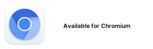
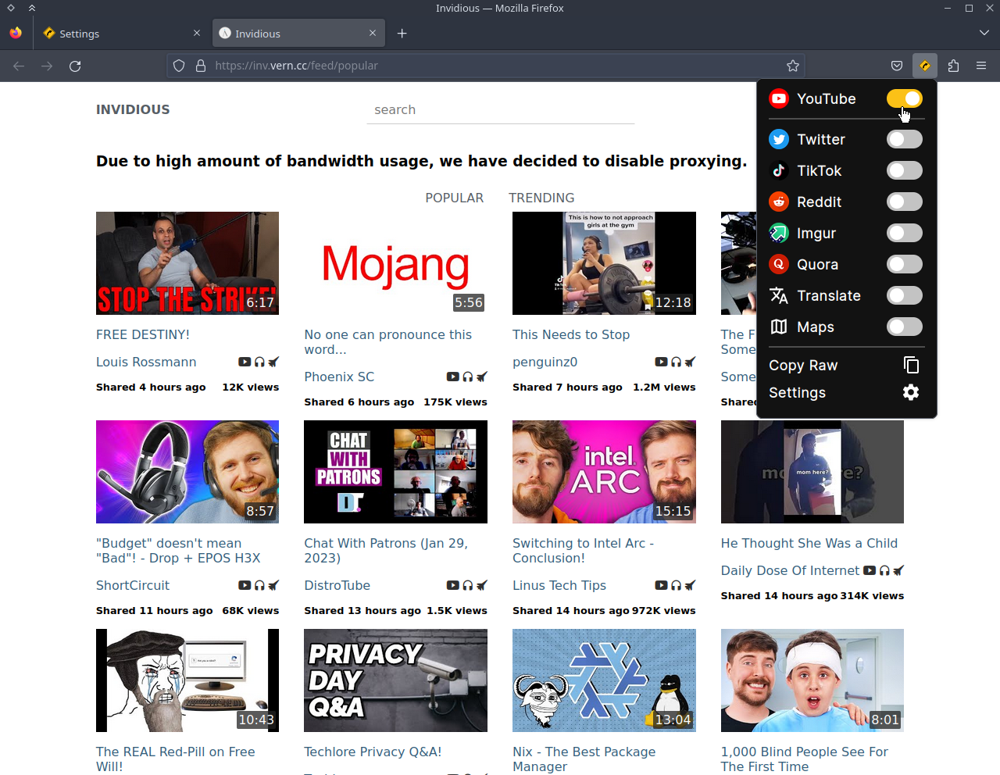
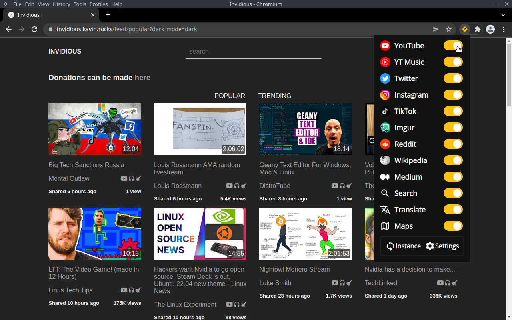
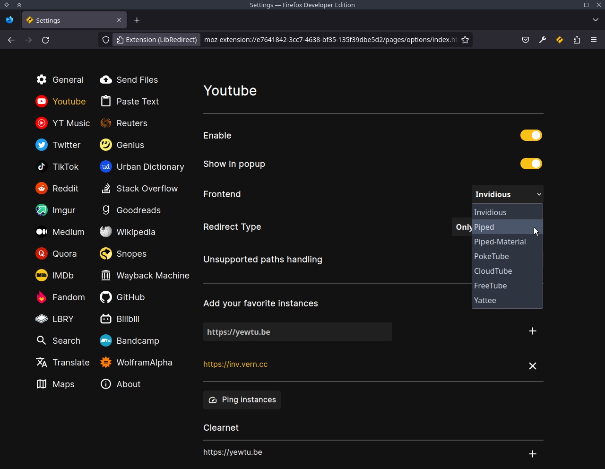
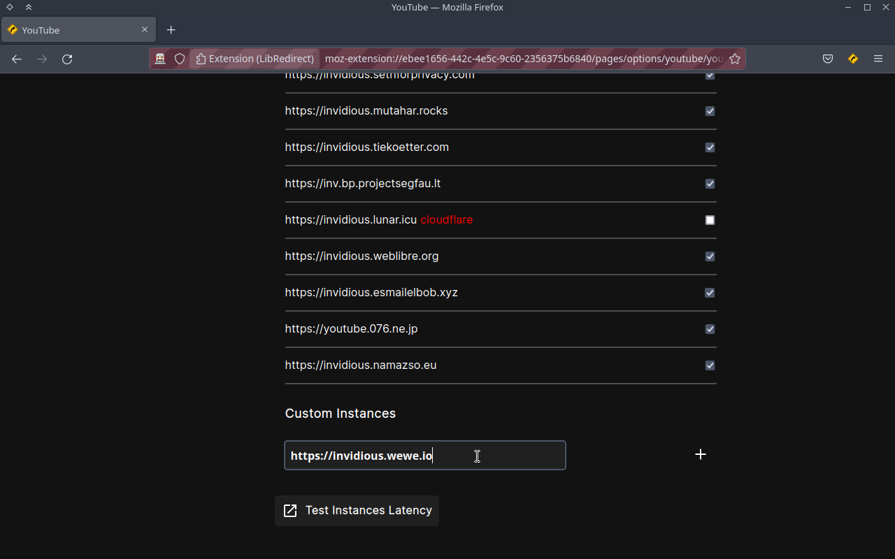
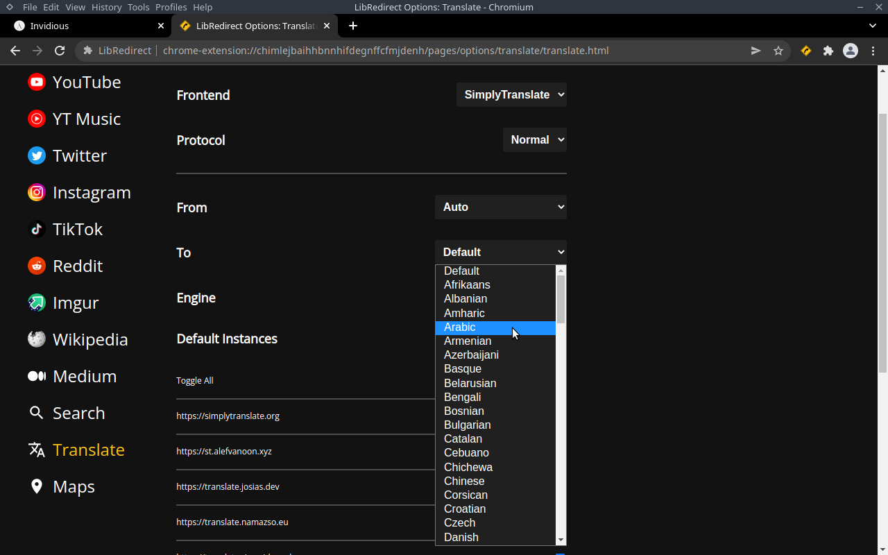

A web extension that redirects YouTube, Twitter, Instagram and many more requests to alternative privacy friendly frontends and backends.

&nbsp;
&nbsp;

&nbsp;
&nbsp;
&nbsp;
&nbsp;
&nbsp;

Youtube => [Piped](https://github.com/TeamPiped/Piped), [Invidious](https://github.com/iv-org/invidious), [Piped-Material](https://github.com/mmjee/Piped-Material), [FreeTube](https://github.com/FreeTubeApp/FreeTube), [Yattee](https://github.com/yattee/yattee)\
Youtube Music => [Beatbump](https://github.com/snuffyDev/Beatbump)\
Twitter => [Nitter](https://github.com/zedeus/nitter)\
Instagram => [Bibliogram](https://sr.ht/~cadence/bibliogram/)\
TikTok => [ProxiTok](https://github.com/pablouser1/ProxiTok)\
Reddit => [Libreddit](https://github.com/spikecodes/libreddit#instances), [Teddit](https://codeberg.org/teddit/teddit#instances), [Old Reddit](https://old.reddit.com)\
Imgur => [Rimgo](https://codeberg.org/video-prize-ranch/rimgo)\
Pixiv => [pixiv萌え](https://github.com/kokororin/pixiv.moe)\
Speedtest => [Librespeed](https://github.com/librespeed/)\
Spotify => [Soju](https://github.com/coffeebank/soju)\
Wikipedia => [Wikiless](https://codeberg.org/orenom/wikiless)\
Medium => [Scribe](https://sr.ht/~edwardloveall/scribe/)\
Peertube => [SimpleerTube](https://git.sr.ht/~metalune/simpleweb_peertube)\
LBRY/Odysee => [Librarian](https://codeberg.org/librarian/librarian)\
Search => [SearX](https://searx.github.io/searx/), [Whoogle](https://benbusby.com/projects/whoogle-search/)\
Translate => [SimplyTranslate](https://git.sr.ht/~metalune/simplytranslate_web), [LingvaTranslate](https://github.com/TheDavidDelta/lingva-translate)\
Maps => [OpenStreetMap](https://www.openstreetmap.org/), [FacilMap](https://github.com/FacilMap/facilmap)\
Send Files => [Send](https://github.com/timvisee/send)

**Note**: The Extension will be using random instances by default. You can modify this and add custom instances too.

## Donate

\
BTC: **bc1qrhue0frps6p2vkg978u9ayethnwprtmfug827q**

## Development

### Install Dependencies
- [Node.js](https://nodejs.org/) latest LTS is recommended
- `npm update`
- `npm install`

### Build
- `npm run build`

### Test
- `npm run test`

### Test in Firefox
- `npm run start`

### Install temporarily
- open `about:addons`
- click on the settings button below the addon search bar and select `debug add-on`
- press `load temporarily addon`

### Install in Firefox ESR, Developer Edition, Nightly
- open `about:config`
- set `xpinstall.signatures.required` to `false`
- open `about:addons`
- click on the gear shaped `settings` button and select `Install Add-on From File...`
- select `libredirect-VERSION.zip` from `web-ext-artifacts` folder

### Install in Chromium browsers
- open `chrome://extensions`
- enable `dev mode`
- select `load unpacked extension`
- select `src` folder

[FAQ](https://github.com/libredirect/libredirect/wiki/FAQ)\
[Privacy Policy](Privacy-Policy.md)\
Credits: [Privacy Redirect](https://github.com/SimonBrazell/privacy-redirect)
