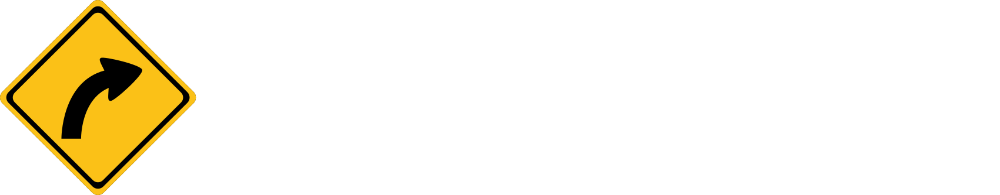

A browser extension that redirects YouTube, Twitter, TikTok, and other requests
to alternative privacy-friendly frontends.

<a href="https://addons.mozilla.org/firefox/addon/libredirect/">
  
</a>
&nbsp;
<a href="https://libredirect.manerakai.com/download_chromium.html">
  
</a>

## Donate

<a class="badge_medium" href="https://opencollective.com/libredirect">
  
</a>
&nbsp;
<a class="badge_medium" href="https://patreon.com/libredirect">
  
</a>
&nbsp;
<a class="badge_medium" href="https://github.com/sponsors/libredirect">
  
</a>

<br/>
<br/>

BCH (Bitcoin Cash): `qqz5vfnrngk0tjy73q2688qzw4wnllnuzqfndflhl8`\
ETH (Ethereum): `0x896e5796da76e49a400a9186e1c459cd2c64b4e8`\
XMR (Monero): `4AM5CVfaGsnEXQQjZSzJvaWufe7pT86ubcZPr83fCjb2Hn3iwcForTWFy2Z3ugXcufUwHaGcucfPMFgPXBFSYGFvNrmV5XR`

If you wish to donate via BTC, please swap it and send it to our BCH address instead. We recommend [fixedfloat.com](https://fixedfloat.com/) to swap your crypto.

## Translate

<a href="https://hosted.weblate.org/projects/libredirect/extension">
  
</a>

## Development

Install [Node.js](https://nodejs.org) and [pnpm](https://pnpm.io).

> [!NOTE]
>
> Do not test in your work environment. Create a new profile for testing or
> download a separate browser.

```bash
git clone https://github.com/libredirect/browser_extension && cd browser_extension
pnpm install
# Generates HTML using Pug
pnpm run html
```

### Firefox

```bash
# Run Firefox with the extension
pnpm run start

# Build a zip package for Firefox
pnpm run build
```

#### Install the zip package on Firefox (temporarily)

1. Type `about:debugging#/runtime/this-firefox` in the address bar.
2. Click **Load Temporary Add-on...**.
3. Select `libredirect-VERSION.zip` from the `web-ext-artifacts/` folder.

#### Install the zip package on Firefox ESR, Developer Edition, Nightly

1. Type `about:config` in the address bar.
2. Set `xpinstall.signatures.required` to `false`.
3. Type `about:addons` in the address bar.
4. Click the gear-shaped settings button and select **Install Add-on From
   File...**.
5. Select `libredirect-VERSION.zip` from the `web-ext-artifacts/` folder.

### Chromium

1. Open `chrome://extensions`.
2. Enable **Developer mode**.
3. Click **Load unpacked**.
4. Select the `src/` folder.

### Test

See [TEST.md](./TEST.md).

## Privacy Policy

- Nothing is collected.
- All URL redirections work locally, except for OpenStreetMap reverse geocoding,
  which is done via the
  [OSM Nominatim API](https://nominatim.org/release-docs/develop/api/Overview).
- By default, the list of instances is fetched from GitHub. Alternatively, it
  may be fetched from Codeberg or not at all.

## Notes

Forked from
[Privacy Redirect](https://github.com/SimonBrazell/privacy-redirect).
